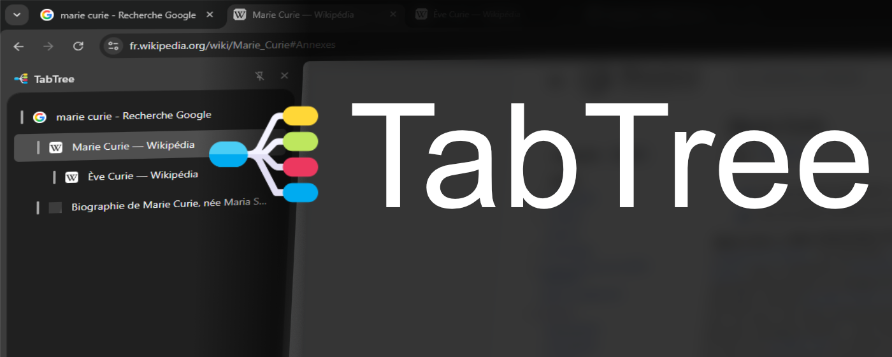
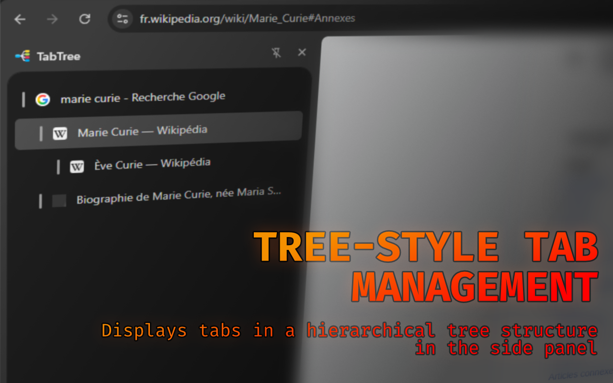
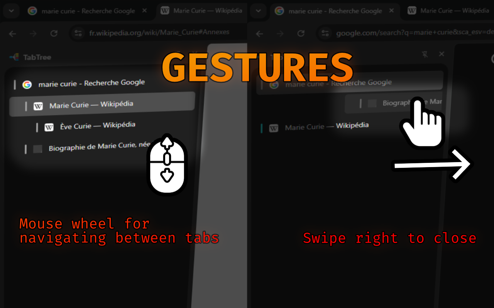
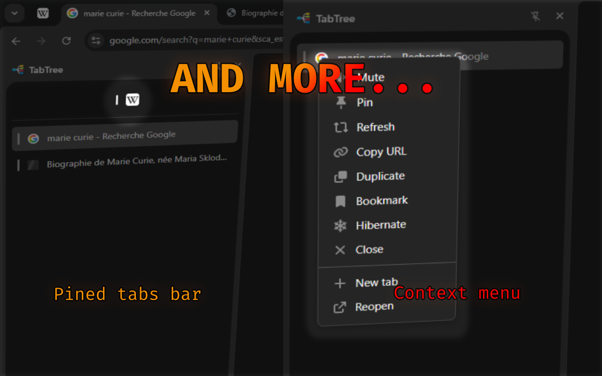

<h1 align="center" id="title">TabsTree</h1>

  

A tab management sidebar with tree structure and advanced features.

  

  
  

  

<h2>Screenshots:</h2>

 
  
<h2>Features</h2>

#### Main Features
- Tree-Style Tab Management: Displays tabs in a hierarchical tree structure in the side panel;
- Organization: Automatically open new tabs as children of the current tab (unless it's a "New Tab" page);
- Drag-and-Drop: Supports creating custom hierarchies, also preserves hierarchy when moving tabs between windows;
- Pinned Tabs: Separate section for pinned tabs at the top of the sidebar;
- Ease of Use: Drag URLs or signets into the sidebar to create new tabs.

#### Quick Gestures
- Close tab with Middle Mouse Button or swiping it right;
- Double Click a tab toggle Mute/Unmute;
- Double Click an empty space open a new tab;
- Wheel Scroll cycle through tabs in the window;
- Right Click open a Context Menu (Mute/Unmute, Pin/Unpin, Reload, Copy URL, Duplicate, Bookmark the tab, Bookmark tabs' Child in a folder, Hibernate (discard tab to save memory), Close, New Tab, Reopen Closed Tab).

#### Visual Feedback
- Active tab highlighting;
- Audio playing indicator (pulsing);
- Muted status (red);
- Hibernated status (cyan).

#### Also
- Smart Tab Lifecycle: Re-parenting of children when a parent tab is closed (children move to the grandparent), smart tab activation when closing a tab (activates sibling or parent).

 

<h2>Thanks to</h2>

js-crc32 - [SheetJS](https://github.com/SheetJS/js-crc32)

Logo - [Freepik](https://www.flaticon.com/free-icon/mind-map_9185588)

Context menu icons - [AwesomeFont](https://fontawesome.com/)